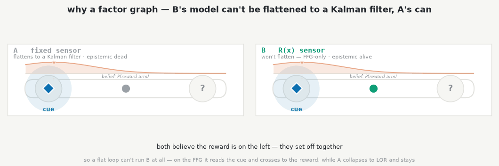
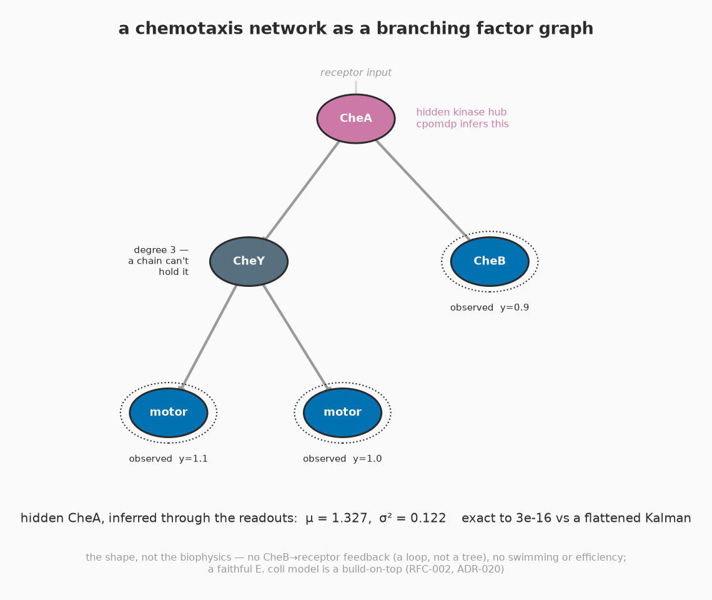
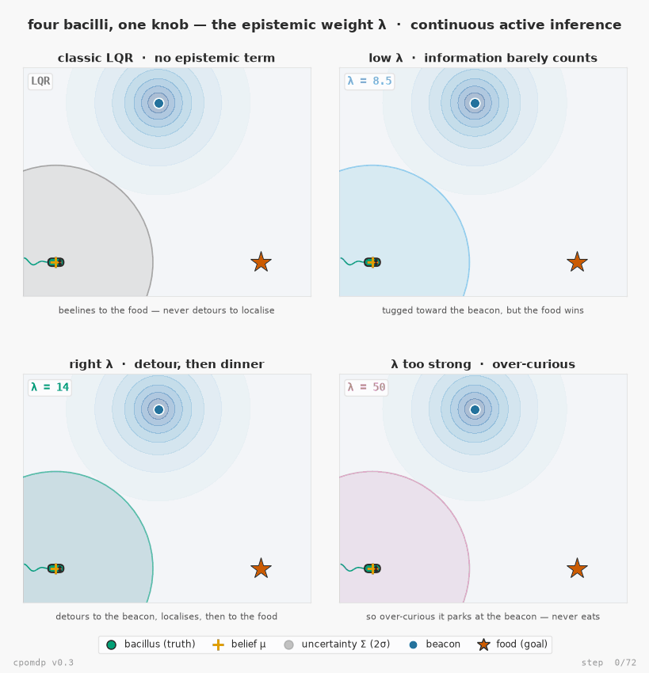
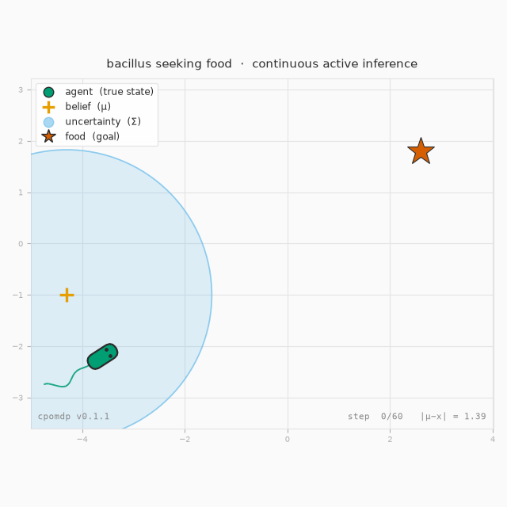
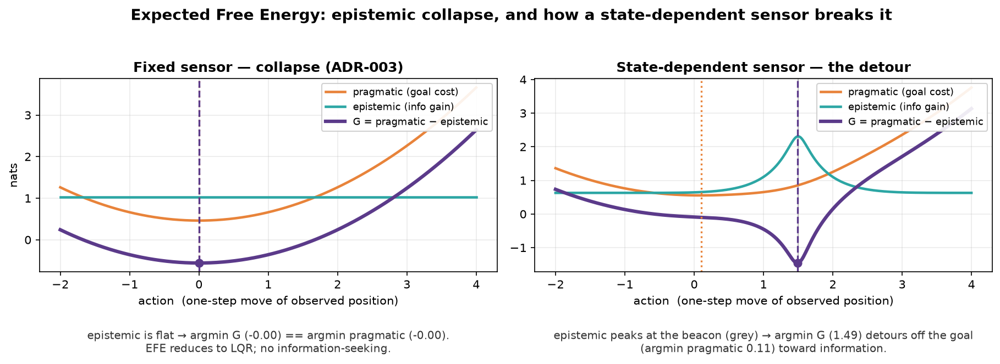
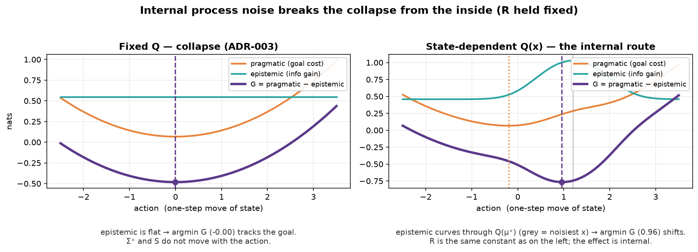

# Examples gallery

Runnable scripts that render these figures live in
[`examples/`](https://github.com/inferogenesis/cpomdp/tree/main/examples). They are
**not** part of the installed package (only `cpomdp` itself ships in the wheel) — they
import plotting libraries the core does not depend on. Get those with the `examples`
extra:

```bash
pip install "cpomdp[examples]"        # then: python examples/<script>.py
```

…or, from a source checkout, with uv: `uv run --extra examples python examples/<script>.py`.

## Flagship — instrumental epistemics: the beacon resolves food location

[`bacillus_uncertain_food.py`](https://github.com/inferogenesis/cpomdp/blob/main/examples/bacillus_uncertain_food.py) · v0.4 · ADR-013

Four bacilli in one world, differing in a single number — the **goal precision Λ** —
all minimising the same Expected Free Energy `G = pragmatic − epistemic`. The twist over
the v0.3 original (now in "the journey" below): the food's position is an explicit
**latent** the agent does not know a priori, and the beacon resolves *that* rather than
the agent's own position. So the information the beacon buys is **instrumental** — it
changes where the agent then heads — the decision-relevant epistemic value of the
discrete T-Maze task (Friston et al. 2015), which the v0.3 self-revealing beacon lacked.
The rewiring is one sensor channel; the beacon mechanic is untouched.

Classic LQR and a sharp Λ both beeline to the current food estimate and settle soonest
(step 18 of 90); a balanced Λ detours to the beacon, learns where the food really is,
*then* heads there; a weak Λ over-curiously parks at the beacon and never eats. The
detour is not free and not fastest — balanced arrives last of the regimes that arrive
(step 41) and travels farthest — but it buys precision: its final belief about the food
is ≈7x tighter than the beeliners'. Each panel's `t=` counter and border turn green and
freeze the moment that regime settles, so the GIF shows *when* each arrives, not just
whether.

The simulation is checked, not just rendered: `--scan` runs every filter through **both**
the native `KalmanBackend` and the v0.4 FFG `ChainBackend` and asserts they agree to
`atol=1e-7`.


## FFG examples — branching factor graphs

The v0.4 examples that need a *branching* model rather than a chain. Full writeups in the
[FFG sub-gallery](https://github.com/inferogenesis/cpomdp/blob/main/examples/ffg/README.md).

### A branch-coupled R(x) can't be flattened

[`epistemic_dissociation_figure.py`](https://github.com/inferogenesis/cpomdp/blob/main/examples/ffg/epistemic_dissociation_figure.py) · v0.4 · ADR-019, ADR-020, ADR-021

Why an **Forney-style Factor Graph (FFG)** over a flat loop? Because a flat loop can't run B's model at all. Ask
`CouplingGraphBackend.to_flat_model()` to flatten it and you get
`IncompatibleLinearizationError` — B's state-dependent `R(x)` sits on a coupling, a
mean-shifting coupling makes μ⁺ ≠ μ⁻, so no fixed linear-Gaussian model reproduces `R(μ⁺)`.
A's fixed sensor flattens fine. Then the behaviour that buys: two agents on the same maze,
differing in that one line. B's live epistemic term detours to read the cue, resolves a hidden
context through the branch, and crosses to the reward; A's constant epistemic term (Koudahl–Kouw–de
Vries 2021) collapses to LQR and it stays at the wrong arm. A control statement, not biology
(ADR-020). `--check` prints the four results without plotting.



### Declare the structure, skip the joint

[`coupling_graph_figure.py`](https://github.com/inferogenesis/cpomdp/blob/main/examples/ffg/coupling_graph_figure.py) · v0.4 · ADR-012, ADR-014

The factor graph earns its keep the moment the model *branches*: a hidden root `r` seen only
through a hub `h` that fans out to two observed leaves, a degree no chain can hold. The figure
sets `CouplingGraph.infer` (name the edges, call once) beside the 4x4 joint precision a normal
backend makes you assemble, invert, and marginalise back down to `r`. Both land on the same
belief (μ ≈ 1.234, σ² ≈ 0.137) to floating-point noise; the branching stays *declared* instead
of flattened (ADR-014).


### A chemotaxis network, as its shape

[`chemotaxis_figure.py`](https://github.com/inferogenesis/cpomdp/blob/main/examples/ffg/chemotaxis_figure.py) · v0.4 · ADR-012, ADR-020

The same declare-and-infer on a real branching network: E. coli chemotaxis, a receptor-driven
CheA kinase hub feeding a fast CheY → motor branch and a slow CheB methylation branch — a tree
with a degree-3 node no chain can hold. cpomdp infers the hidden CheA hub from the downstream
readouts (CheB and the two motors), exact to a flattened Kalman. It's the shape, not the
biophysics: no CheB → receptor feedback (a loop, not a tree), no swimming or efficiency; a
faithful E. coli model is a build-on-top (RFC-002, ADR-020).



## The journey

### Four bacilli, one knob — the v0.3 original (beacon reveals YOUR position)

[`bacillus_seeking_food.py`](https://github.com/inferogenesis/cpomdp/blob/main/examples/bacillus_seeking_food.py) · v0.3

The flagship's predecessor: same four-regime shape, but the beacon collapses uncertainty
about the agent's *own* position rather than the food's — illustrative, but the simpler,
non-instrumental form of epistemic value the flagship's ADR-013 critique is about. The
simulation is real — every agent shares one Kalman filter over a `CallableSensor` whose
`R(x)` dips at the beacon, and the EFE agents call the library's own
`expected_free_energy` kernel.



### Bacillus seeking food — the original (pure LQR)

[`bacillus_lqr.py`](https://github.com/inferogenesis/cpomdp/blob/main/examples/bacillus_lqr.py)

Where it started (v0.2): a *single* bacillus with a fixed sensor, so the epistemic term
collapses to nothing (ADR-003) and active inference reduces to LQR — it perceives, acts,
and arrives. The flagship above is its v0.3 successor, switching the epistemic term back
on with a state-dependent sensor.



### EFE epistemic collapse, and how a state-dependent sensor breaks it

[`efe_collapse_figure.py`](https://github.com/inferogenesis/cpomdp/blob/main/examples/efe_collapse_figure.py)

Sweeps a one-step action and plots `G = pragmatic − epistemic` for a fixed sensor
(epistemic dead-flat → EFE collapses to LQR) versus a state-dependent sensor (a precision
well makes the epistemic term curve, pulling the argmin off the goal toward information).



### Internal process noise breaks the collapse from the inside

[`internal_noise_figure.py`](https://github.com/inferogenesis/cpomdp/blob/main/examples/internal_noise_figure.py)

The companion: the sensor noise `R` is held fixed and the action-dependence of the
epistemic term comes entirely from state-dependent **process** noise `Q(x)` — the
internal-precision route of RFC-001 §8.


