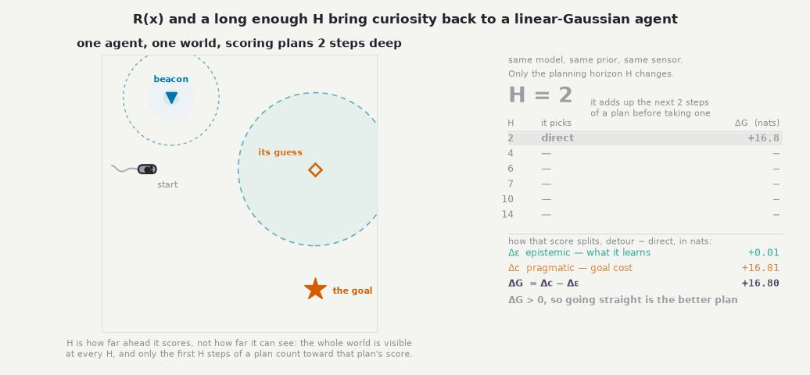
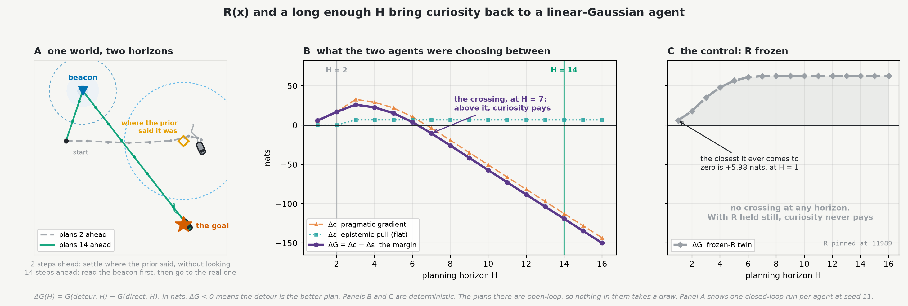

# Examples gallery

Runnable scripts that render the figures in the docs and README. They are **not**
part of the installed package (only `src/cpomdp` ships in the wheel) — they import
plotting libraries the core does not depend on. The examples are not subject to
the same level of precision as the rest of cpomdp. They are here as showcases. The
numbers in them are not citable facts.

Get the plotting deps with the `examples` extra:

```bash
pip install "cpomdp[examples]"        # then: python examples/<script>.py
```

…or, from a source checkout, with uv (no install needed):

```bash
uv run --extra examples python examples/<script>.py
```

Each script writes its asset into [`../docs/assets/`](../docs/assets/) and takes an
optional output path as `argv[1]`.

---

## Flagship — instrumental epistemics: the beacon resolves food location

[`bacillus_uncertain_food.py`](bacillus_uncertain_food.py) · v0.4 · ADR-013

Expected Free Energy decomposes into an **epistemic** (information-seeking) value and
a **pragmatic**/**instrumental** (goal-seeking) value. Epistemic value is genuinely
*instrumental* — not merely curious — when the uncertainty it resolves is
decision-relevant: the discrete T-Maze task (Friston et al. 2015, "Active inference
and epistemic value") is the canonical case, where visiting a cue resolves which arm
holds the reward, changing the *subsequent* action. The v0.3 demo below ties the
beacon's epistemic value to the agent's *own* position — salience without an
instrumental payoff, since knowing your own position more precisely doesn't change
which action is later correct. This flagship promotes the food's position to an
explicit latent the agent does not know a priori, and rewires the beacon to resolve
*that* instead — now the resolved uncertainty changes where the agent then heads, the
property the v0.3 demo's epistemic value lacked. The whole change is one rewiring, the
beacon mechanic itself untouched:

```python
# v0.3: the state is the agent's position, and the one channel reads it. The noise
# that channel carries is keyed on that SAME position — self-revealing.
observation_matrix = I                      # C: o = agent_xy            (2x2)
noise_fn(x, p) = beacon_noise(x, p)   # R(x): keyed on the channel's own block

# v0.4: the state gains the food's position as a latent, and a second pair of rows
# reads the DISPLACEMENT to it. The noise is still keyed on the agent's own
# position block, exactly as before.
observation_matrix = [[I, 0],               # C: rows 1-2  o = agent_xy   (4x4)
                [-I, I]]              #    rows 3-4  o = food_xy − agent_xy
noise_fn(x, p) = beacon_noise(x[:2], p)  # R(x): still keyed on agent_xy only
```

Same four-regime structure as the v0.3 demo, same single real knob (the goal precision
Λ): classic LQR and a sharp Λ both beeline toward the current food estimate and never
detour — with LQR's effort cost set to ≈0 to match the EFE selection (which has none),
the two are the *same* controller here, the fixed-sensor collapse
([Koudahl, Kouw and de Vries 2021](https://doi.org/10.3390/e23121565), ADR-003)
made visible; a balanced Λ detours to the beacon, learns where food really is,
*then* heads there with confidence; a weak Λ is so over-curious it parks at the beacon
and never eats. Each panel carries its own `t=` step counter and border, which
turn green and freeze the moment that regime first settles near the food, so the GIF
shows directly *when* each one gets there, not just whether.

That border cue is also what makes the detour's actual cost legible: the balanced
regime is **not** the fastest. The two beeliners — classic LQR and sharp Λ=0.05 — settle
soonest, together at step 18 of 90 on near-identical shortest paths (9.6 and 9.9
units travelled); balanced (Λ=0.015) is the slowest of the regimes that arrive at all (step
41) and travels the farthest (≈13.8 units), *because* it deliberately detours. What that
detour buys is precision, not speed: once settled, balanced's belief about the food's
location is roughly 7x tighter than the beeliners' (final covariance trace ≈0.004 vs
≈0.029) and its final position error is close to four times smaller (0.04 vs 0.15
and 0.18). It is an explore/exploit trade — time and distance traded for confidence —
not a regime that wins on every axis.

The simulation is checked, not just rendered: every agent's filter is run through
**both inference backends**, and `--scan` checks the native `KalmanBackend` and the
v0.4 FFG `ChainBackend` agree to `atol=1e-7`.


`bacillus_uncertain_food.py --scan` prints the regime metrics and the
Kalman-vs-ChainBackend agreement check without rendering.

---

## Forney-style Factor Graph (FFG) examples — branching factor graphs

The v0.4 examples that need a branching model rather than a chain live in their own
sub-gallery — the dissociation demo (a branch-coupled `R(x)` sensor that can't be flattened
to a Kalman filter), the coupling-graph figure, and a chemotaxis-network figure. See
**[`ffg/README.md`](ffg/README.md)**.

---

## R(x) and a long enough H bring curiosity back to a linear-Gaussian agent

[`crossover_horizon_figure.py`](crossover_horizon_figure.py)

Under a **fixed** linear-Gaussian sensor the epistemic term of expected free energy is a
constant across policies. It cannot change any decision. The agent reduces to LQR, the
collapse [`efe_collapse_figure.py`](efe_collapse_figure.py) draws. A state-dependent
`R(x)` breaks that: the action reaches the noise, so curiosity becomes *possible* again.
Possible is not the same as decisive.

An open plane. The agent wants to be at a goal it cannot locate. Its prior says the goal
is over to the right. It is not. A beacon well off that line is the only thing that can
tell it where the goal really is. Walking there costs ground.

The animation runs the same world once per planning horizon, and the ladder on the right
fills in as it goes. At a short horizon the agent walks straight to the spot it already
believed in and settles there. It never checks. Somewhere in the sweep it stops doing
that: it walks *away* from where it thinks the goal is, reads the beacon, finds out it was
wrong, and then goes to the real one. Nothing changed but `H`. Same model, same prior,
same sensor, same two candidate plans, same objective.



### Reading the numbers beside the animation

Expected free energy splits in two, `G = c − ε`:

- **`c`, the pragmatic term**. How far the observations a plan expects to get sit from
  the ones the agent prefers. Here: how far from the goal it ends up.
- **`ε`, the epistemic term**. How much the agent expects that plan to *teach* it. Here:
  how much sharper its belief about where the goal is will be.

Lower `G` wins, so a plan is worth taking when what it teaches outweighs what it costs.

Every number shown is a **difference between the two candidate plans**, detour minus
direct, in **nats**:

| quantity | what it is |
| --- | --- |
| `Δε = ε(detour) − ε(direct)` | the extra information the detour buys |
| `Δc = c(detour) − c(direct)` | the extra goal cost it pays for it |
| `ΔG = Δc − Δε = G(detour) − G(direct)` | which plan wins |

The difference is the whole decision: whatever the two plans have in common cancels out
of it, so the absolute `G` of either one tells you nothing about which gets picked. `ΔG`
above zero and the agent goes straight. Below zero and it detours. That is also why the
ladder swings from `+16.8` to `−119.2`. Neither plan "has" that score. It is how far apart
they are, and the gap widens as the horizon gives the detour more steps to collect on what
it learned.

### What "planning horizon" means here

`H` is how many steps of a plan the agent adds up when it scores that plan. **Not** how
far it can see. Perception does not change with `H` at all: the world is fully visible
throughout, and the beacon is exactly as informative to an `H = 2` agent standing on it
as to an `H = 14` one. What `H` changes is how much of a plan's consequence is inside the
window when the agent commits to its next single step.

Two steps cannot *reach* the beacon. The information it would buy falls outside the
window entirely and never reaches the balance sheet: `Δε` there is under 0.01 nats,
essentially nothing. By `H = 7` the sensing step is inside the window, and so are the
steps that cash in on it.

### Why the horizon decides it

The epistemic pull is *flat*. Sensing once is worth what sensing once is worth, so `Δε`
does not grow with the horizon. What moves is `Δc`. After the detour the sharpened goal
belief lowers the expected goal cost on every remaining step, and that saving accumulates
until it covers the one-off cost of walking off course. So the direct plan's advantage
decays under a constant pull, and `ΔG` crosses zero exactly once.

The right-hand panel below is the control. A beacon-and-goal task on a plane looks like
the discrete cue tasks people already know, so the whole sweep is re-run with `R` frozen
at a constant, everything else identical. Curiosity then never pays at any horizon.
What freezing `R` zeroes is `Δε`, not `ε`. With a fixed noise the covariance recursion
stops consulting the action, so both plans carry the identical covariance sequence and
whatever either one learns cancels out of the difference. Each plan's own `ε` is still
nonzero and still grows with `H`. Action-invariance is the collapse, not absence. It
takes `R(x)` *and* the horizon.



`--check` prints the sweep and asserts what the figures claim, with no plotting deps.
Everything asserted is open-loop, so none of it takes a seed. The animated runs take one,
named in the caption. Where the crossing lands belongs to these particular numbers. The
shape carries over. The integer does not.

### This is not the registered `H*`

The library's `H*` is also 7, and the two have nothing to do with each other. That one is
an exhaustive `|A|^H` search over a declared, versioned action set on the two-node coupled
cue tree, with the epistemic term restricted to the context node, and it carries a
completeness certificate. Its `Δε` at `H = 1` is 1.72 nats.

This demo scores two named plans on a flat four-dimensional chain, takes the epistemic term
over the whole state, and searches nothing at all. Its `Δε` is 6.67 nats. The two integers
coincide. Nothing follows from that, and neither number should be quoted as the other.

The difference is what each one is entitled to claim. An exhaustive enumeration over a
declared finite set *decides* that no policy in the set flips, which is why the corridor
result carries `PROVED` and a completeness certificate. A two-policy contrast decides
nothing about the argmin: the best plan at any horizon could be a third one neither of
these. So the crossing drawn here is an exact fact about a detour and a direct route, and
the plane is where the mechanism is legible rather than where it is established. The
corridor is the proof, in [`ffg/crossover.py`](ffg/crossover.py) and
[`warrant_numbers.md`](../warrant_numbers.md), and it answers a question left open by
[arXiv:2607.20306](https://arxiv.org/abs/2607.20306): that paper gets the epistemic term
to stop being constant, and stopping being constant is not yet changing a decision.
